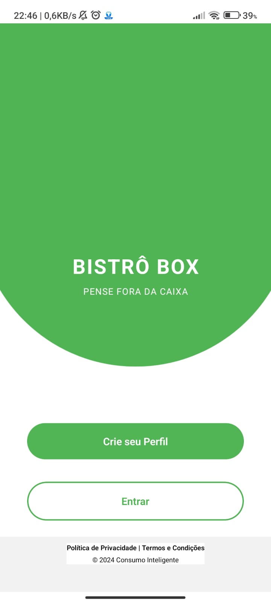

# Bistro Box App

Este é um aplicativo mobile desenvolvido em React Native com Expo, focado no gerenciamento de pedidos e reservas de um restaurante. O app permite que usuários façam pedidos, visualizem cardápios, acompanhem status, além de funcionalidades para funcionários como controle de reservas e atendimento.

---

## 🚀 Tecnologias Utilizadas

- **React Native (Expo)**: Framework para desenvolvimento mobile multiplataforma.
- **TypeScript**: Tipagem estática para maior segurança no desenvolvimento.
- **Tailwind CSS com Nativewind**: Estilização rápida e responsiva.
- **Node.js (no backend)**: Para integração com APIs.
- **Axios**: Comunicação com APIs.
- **Zod**: Validação de schemas e dados.
- **EAS (Expo Application Services)**: Build e deploy do aplicativo.
- **React Navigation**: Gerenciamento de rotas e navegação.
- **Context API / Hooks**: Gerenciamento de estado no app.
- **AsyncStorage**: Armazenamento local de dados no dispositivo.
- **Expo Assets**: Gerenciamento de imagens e fontes.

## Estrutura de pastas
 bistro-box-app-main/
├── assets/ # Imagens, fontes e mídias
├── Components/ # Componentes reutilizáveis
├── data/ # Dados fixos ou mockados
├── screens/ # Telas principais do aplicativo
├── services/ # Serviços e API (requisições HTTP)
├── utils/ # Funções auxiliares e utilitários
├── App.tsx # Arquivo principal do app
├── package.json # Dependências e scripts
├── app.json # Configurações do projeto Expo
├── tailwind.config.js # Configuração do Tailwind
├── tsconfig.json # Configurações do TypeScript


---

## 🎯 Funcionalidades do App

- 📋 Visualização de cardápio
- 🛒 Realização de pedidos
- ⌛ Acompanhamento de status dos pedidos
- 📅 Gerenciamento de reservas
- 🔑 Login e autenticação de usuários
- 👥 Perfis para clientes e atendentes
- 📦 Integração com APIs externas (backend local ou remoto)
- 🌙 Suporte a tema claro e escuro (se implementado)

---
## 📸 Prints do App

### 🏠 Tela Inicial


## ⚙️ Instalação e Execução

1. Instalar dependências:
```bash
npm install

- **Jest (se utilizado)**: Testes unitários.
Rodar o projeto:

bash
Copiar
Editar
npx expo start

---


